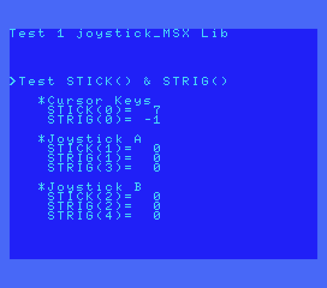
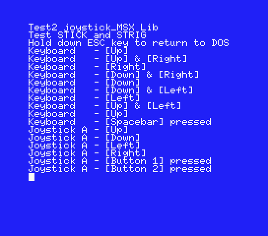
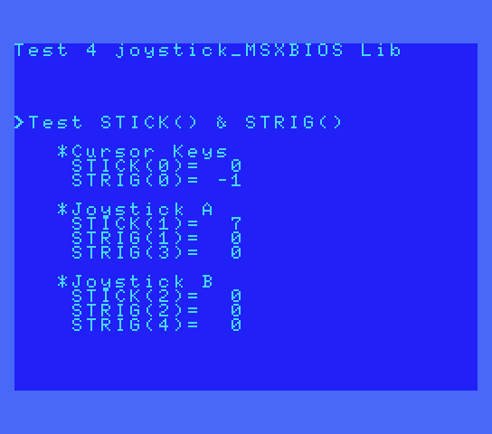
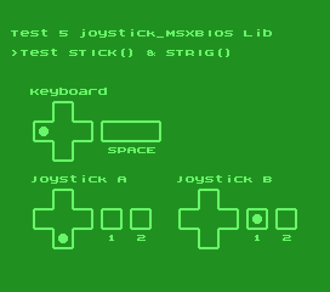

# Joystick MSX SDCC Library (fR3eL Project)

<table>
<tr><td>Architecture</td><td>MSX</td></tr>
<tr><td>Format</td><td>C Object (SDCC .rel)</td></tr>
<tr><td>Programming language</td><td>C and Z80 assembler</td></tr>
<tr><td>Compiler</td><td>SDCC v4.4 or newer</td></tr>
</table>

---

## Description

Library with basic functions for reading joystick controllers or cursor keys of MSX computers.

In this project you will find two libraries for different environments:
- **joystick_MSX** Does not use the MSX BIOS. You can use it for any environment (ROM, MSX BASIC or MSX-DOS)
- **joystick_MSXBIOS** Uses the MSX BIOS. It takes up very little memory. You can use it in ROMs from 8 to 32K or programs that run from MSX BASIC environment.

The functions work with the same values ​​as the corresponding instructions in MSX BASIC.

You can access the documentation here with [`How to use the library`](docs/HOWTO.md).

These libraries are part of the [MSX fR3eL Project](https://github.com/mvac7/SDCC_MSX_fR3eL).

Use them for developing MSX applications using Small Device C Compiler [`SDCC`](http://sdcc.sourceforge.net/).

This project is an Open Source. 
You can add part or all of this code in your application development or include it in other libraries/engines.

Enjoy it!

 

---

## Requirements

- [Small Device C Compiler (SDCC) v4.4](http://sdcc.sourceforge.net/)
- [Hex2bin v2.5](http://hex2bin.sourceforge.net/)

 

---

## Functions

| Name | Declaration | Description |
| ---  | ---   | ---         |
| STICK | `char STICK(char joy)` | Returns the joystick status |
| STRIG | `signed char STRIG(char triggerN)` | Returns the trigger status |

 

---

## Examples

In the source code you can find two applications for testing and learning purposes.

### Test 1

<table>
<tr><td>Library</td><td>joystick_MSX</td></tr>
<tr><td>Format</td><td>MSX 8K ROM</td></tr>
</table>

This application reads and displays the output from the cursor keys and the two joystick ports.

[Source code](examples/Test1_ROM/)

 

### Test 2

<table>
<tr><td>Library</td><td>joystick_MSX</td></tr>
<tr><td>Format</td><td>.COM MSX-DOS</td></tr>
</table>

This application shows in Log format, the pulsations of the directions of the game controllers and the cursor keys, as well as the pulsation of the fire buttons and the space key (keyboard).

[Source code](examples/Test2_MSXDOS/)

 

### Test 3 

<table>
<tr><td>Library</td><td>joystick_MSX</td></tr>
<tr><td>Format</td><td>.COM MSX-DOS</td></tr>
</table>

This application shows on a graphic screen, the pulsations of the directions of the game controllers and the cursor keys, as well as the pulsation of the fire botnoes and the space key (keyboard).

[Source code](examples/Test3_MSXDOS/)

 

### Test 4

<table>
<tr><td>Library</td><td>joystick_MSXBIOS</td></tr>
<tr><td>Format</td><td>MSX 8K ROM</td></tr>
</table>

This application reads and displays the output from the cursor keys and the two joystick ports. 

[Source code](examples/Test4_ROM/)

 

### Test 5

<table>
<tr><td>Library</td><td>joystick_MSXBIOS</td></tr>
<tr><td>Format</td><td>MSX 8K ROM</td></tr>
</table>

This application shows on a graphic screen, the pulsations of the directions of the game controllers and the cursor keys, as well as the pulsation of the fire botnoes and the space key (keyboard).

[Source code](examples/Test5_ROM/)

